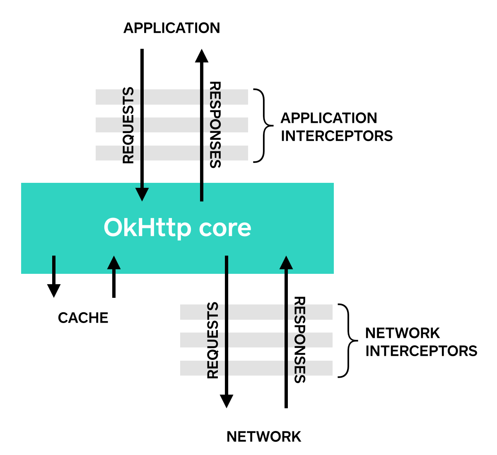
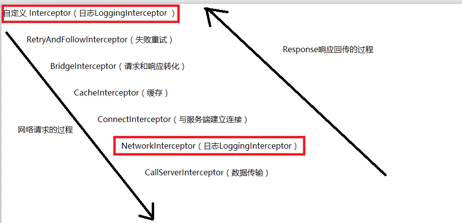

# Interceptor
OKHttp 自定义拦截器

## 拦截器调用过程  

Application Interceptors和Network Interceptors调用阶段  
  

拦截器执行过程  
  
除自定义拦截器外都是由OKHttp系统提供拦截器，整个过程是递归执行的过程。在 CallServerInterceptor 中得到最终的 Response 之后，将 response 按递归逐级进行返回，期间会经过 NetworkInterceptor 最后到达 Application Interceptor 。

## Application Interceptors  
1. 添加Application Interceptors: addInterceptor
2. application interceptor在请求中只调用一次且是拦截器递归中的第一个拦截器，因此会被第一次执行。因此application interceptor的request是最原始的request，但是对于 response 而言呢，因为整个过程是递归的调用过程，因此它会在 CallServerInterceptor 执行完毕之后才会将 Response 进行返回，因此在 Application Interceptor 这里得到的 response 就是最终的响应，即使请求包含重定向或者重试过程，甚至是从缓存中获取的response  
3. 特点: 
    - 不需要去关心中间发生的重定向和重试操作，将会获取到最终响应的response 
    - 只会被调用一次，即使这个响应是从缓存中获取的
    - 只关注最原始的请求，不关心请求的资源是否发生了改变
    - 因为是第一个被执行的拦截器，因此它有权决定了是否要调用其他拦截，也就是 Chain.proceed() 方法是否要被执行
    - 有权多次调用 Chain.proceed() 方法，相当于重新请求的作用

## Network Interceptors  
1. 添加 Network Interceptors: addNetworkInterceptor
2. NetwrokInterceptor会经过 RetryAndFollowIntercptor 进行重定向并且也会通过 BridgeInterceptor进行request请求头和响应resposne的处理，因此可以得到的是更多的信息。
3. 特点:
    - 可以操作经过 RetryAndFollowup 进行失败重试或者重定向之后得到的resposne
    - 对于从缓存获取的 response 则不会去触发 NetworkInterceptor 。因为响应直接从 CacheInterceptor 返回了
    - 可以观察数据在网络中的传输
    - 可以获得装载请求的连接