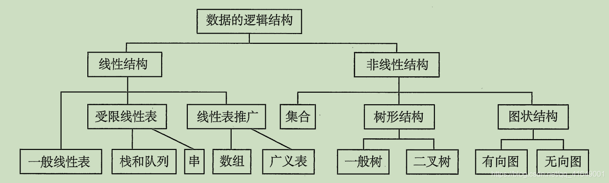

# Java数据结构

##  基本概念
### 数据
数据是信息的载体,是描述客观事物属性的数、字符及所有能输入到计算机中并被计算机程序识别和处理的符号的集合。数据是计算机程序加工的原料。  
数据不仅仅包括数字，还包括声音，图像，视频等非数值类型。这里所说的数据，其实就是符号，而且这些符号具备两个前提:  

    可以输入到计算机中  
    能被计算机程序处理
对于整型等数值类型，可以进行数值运算，对于声音数据，视频数据等非数值类型，可以通过编码的方式转换成字符数据来处理。

### 数据元素
数据元素是数据的基本单位，通常作为一个整体进行考虑和处理。一个数据元素可由若干数据项组成，数据项是构成数据元素的不可分割的最小单位。例如，学生记录就是一个数据元素，它由学号，姓名，性别等数据项组成。 
### 数据对象
数据对象是具有相同性质的数据元素的集合，是数据的一个子集。性质相同是指数据元素具有相同数量和类型的数据项。
### 数据结构
数据结构是相互之间存在一种或多种特定关系的数据元素的集合。在任何问题中，数据元素都不是孤立存在的，他们之间存在某种关系，这种数据元素相互之间的关系成为结构（Structure）  
数据结构包括三方面的内容：逻辑结构，存储结构和数据的运算。逻辑结构是面向问题的，物理结构是面向计算机的，其基本目标就是将数据及其逻辑关系存储到计算机内存中。数据的逻辑结构和存储结构是密不可分的两个方面

## 数据结构三要素
### 逻辑结构
逻辑结构是指数据元素之间的逻辑关系，即从逻辑关系上描述数据。它与数据的存储无关，是独立于计算机的。数据的逻辑结构分为线程结构和非线性结构，线性表是典型的线性结构；集合、树和图是典型的非线性结构。

#### 线性结构
结构中的数据元素只存在一对一的关系，典型的数据结构例如：数组、字符串、队列、栈等

#### 非线性结构
典型的包括树、图

### 存储结构
存储结构是指数据结构在计算机中的表示，也称为物理结构。包括数据元素的表示和关系的表示。  
数据的存储结构主要有顺序存储，链式存储，索引存储和散列存储。  

1. 顺序存储  
把逻辑上相邻的元素存储在物理位置上也相邻的存储单元中，将数据元素放在地址连续的存储单元中，逻辑关系和物理关系是一致的。数组就是这样的顺序存储结构  
优点：可以实现随机存取，每个元素占用最少的存储空间  
缺点：只能使用相邻的一整块存储单元，因此可能产生较多的外部碎片
2. 链式存储  
不要求逻辑上相邻的元素在物理位置上也相邻，数据元素的存储关系并不能反映逻辑关系。借助指示元素存储地址的指针来表示元素之间的逻辑关系。  
优点: 不会出现碎片现象，能充分利用所有存储单元，且存储更加灵活
缺点: 每个元素因存储指针而占用额外的存储空间，且只能实现顺序存取
3. 索引存储  
在存储元素信息的同时，还建立附加的索引表。索引表的每项称为索引项，索引项的形式一般是（关键字，地址）  
优点: 检索速度快
缺点: 附加的索引表额外占用存储空间。另外增加和删除数据时也要修改索引表，会花费较多时间
4. 散列存储  
根据元素的关键字直接计算出该元素的存储地址，又称哈希（Hash）存储  
优点：检索、增加和删除节点的操作都很快  
缺点：若散列函数不好，则可能出现元素存储单元的冲突，而解决冲突会增加时间和空间开销

## 抽象数据类型
### 数据类型
指一组性质相同的值的集合及定义在此集合上的一些操作的总称。数据类型是按照值的不同进行划分的。高级语言中，每个变量，常量和表达式都有各自的取值范围。类型就用来说明变量或表达式的取值范围和所能进行的操作。  

### 抽象数据类型  
抽象数据类型（Abstract Data Type，ADT）：是指一个数学模型及定义在该模型上的一组操作。抽象数据类型的定义仅取决于它的一组逻辑特性，而与其在计算机内部如何表示和实现无关。  
抽象数据类型不仅仅是指那些已经定义并实现的数据类型，还可以是自己定义的数据类型，还包括定义在该模型上的一组操作  
一个抽象数据类型定义了：一个数据对象，数据对象中各数据元素之间的关系及对数据元素的操作。

## 例题
4. 以下与数据的存储结构无关的术语是（）  
    A. 循环队列  
    B. 链表  
    C. 哈希表  
    D. 栈  

解： D  
数据的存储结构有顺序存储、链式存储、索引存储和散列存储。循环队列使用顺序存储标识的队列，是一种数据结构。栈是一种抽象数据类型，可采用顺序存储或者链式存储，只表示逻辑结构。  

5. 以下关于数据结构的说法，正确的是（）  
    A. 数据的逻辑结构独立于其存储结构  
    B. 数据的存储结构独立于其逻辑结构  
    C. 数据的逻辑结构唯一决定了其存储结构  
    D. 数据结构仅由其逻辑结构和存储结构决定  

解：A
数据的逻辑结构是从面向实际问题的角度出发的，只采用抽象表达方式，独立于存储结构。数据的存储方式可以有多种不同选择，而数据的存储结构是逻辑结构在计算机上的映射，不能独立于逻辑结构而存在。数据结构三要素缺一不可。  

6. 链式存储设计时，结点内的存储单元地址（）  
    A. 一定连续  
    B. 一定不连续  
    C. 不一定连续  
    D. 部分连续，部分不连续  

解： A  
链式存储各个不同结点的存储空间可以不连续，但结点内的存储单元地址必须连续

